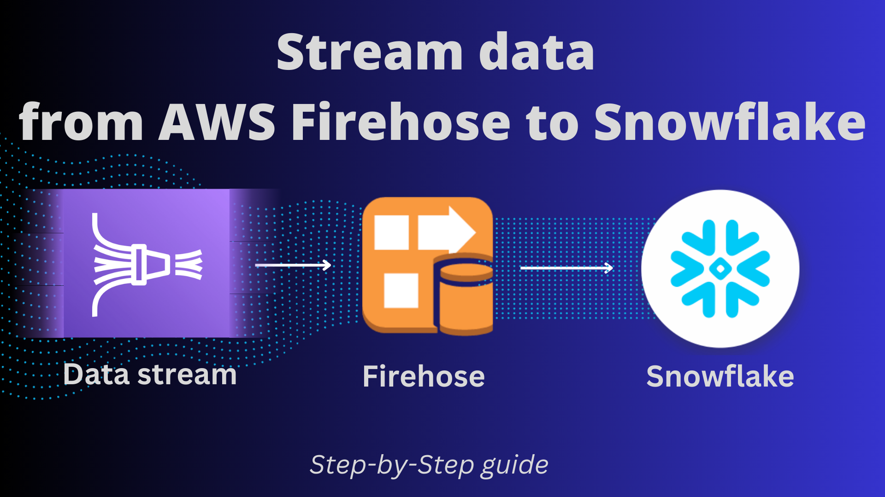

# Firehose to Snowflake - Data streaming
This repo contains all resources you need to setup and test data streaming from AWS firehose
to snowflake.

YouTube video link: https://www.youtube.com/watch?v=Lc2O2jE8Y_E


_**Note:**_ This AWS feature is still in preview. As they recommend not to use it in production yet. read this;
https://aws.amazon.com/about-aws/whats-new/2024/01/stream-data-snowflake-kinesis-data-firehose-snowpipe-streaming-preview/

Snowflake private link:

```sql
-- get account url private link
with PL as
(SELECT * FROM TABLE(FLATTEN(INPUT => PARSE_JSON(SYSTEM$GET_PRIVATELINK_CONFIG()))) where key = 'privatelink-account-url')
SELECT concat('https://'|| REPLACE(VALUE,'"','')) AS PRIVATE_LINK_VPCE_ID
from PL;

-- get VPC ID private link
with PL as
(SELECT * FROM TABLE(FLATTEN(INPUT => PARSE_JSON(SYSTEM$GET_PRIVATELINK_CONFIG()))) where key = 'privatelink-vpce-id')
SELECT REPLACE(VALUE,'"','') AS PRIVATE_LINK_VPCE_ID
from PL;
```


